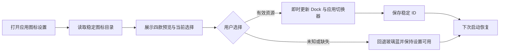
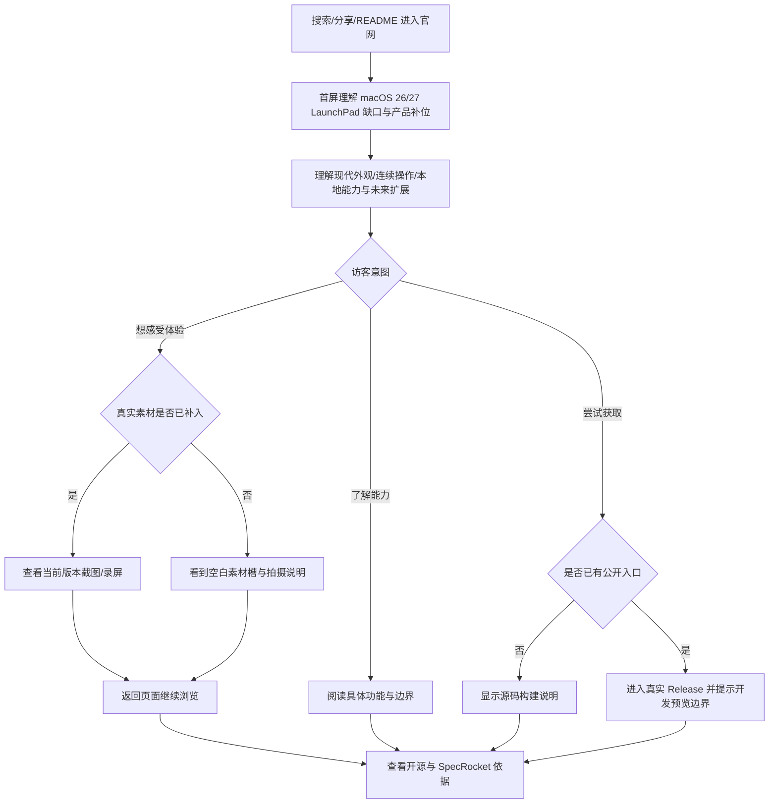

# 冲刺 2：业务流程

## 应用图标选择

```mermaid
flowchart LR
    A[打开应用图标设置] --> B[读取稳定图标目录]
    B --> C[展示四款预览与当前选择]
    C --> D{用户选择}
    D -->|有效资源| E[即时更新 Dock 与应用切换器]
    E --> F[保存稳定 ID]
    D -->|未知或缺失| G[回退玻璃蓝并保持设置可用]
    F --> H[下次启动恢复]
    G --> H
```

访达图标始终来自发布包默认资源，不由运行时选择改写。

## 官网访客路径

```mermaid
flowchart TD
    A[搜索/分享/README 进入官网] --> B[首屏理解 macOS 26/27 LaunchPad 缺口与产品补位]
    B --> B2[理解现代外观/连续操作/本地能力与未来扩展]
    B2 --> C{访客意图}
    C -->|想感受体验| D{真实素材是否已补入}
    D -->|是| E[查看当前版本截图/录屏]
    D -->|否| L[看到空白素材槽与拍摄说明]
    E --> F[返回页面继续浏览]
    L --> F
    C -->|了解能力| G[阅读具体功能与边界]
    C -->|尝试获取| H{是否已有公开入口}
    H -->|否| I[显示源码构建说明]
    H -->|是| J[进入真实 Release 并提示开发预览边界]
    F --> K[查看开源与 SpecRocket 依据]
    G --> K
    I --> K
    J --> K
```

官网不在网页中模拟客户端。截图与录屏由当前发布版本实机采集，网站本身不读取客户端、应用目录或本机布局。
