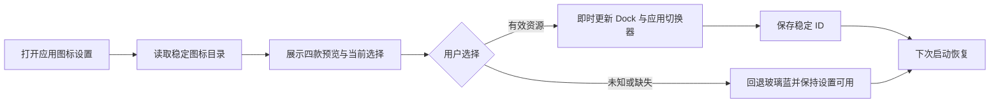

# 冲刺 2：业务流程

## 应用图标选择

```mermaid
flowchart LR
    A[打开应用图标设置] --> B[读取稳定图标目录]
    B --> C[展示四款预览与当前选择]
    C --> D{用户选择}
    D -->|有效资源| E[即时更新 Dock 与应用切换器]
    E --> F[保存稳定 ID]
    D -->|未知或缺失| G[回退玻璃蓝并保持设置可用]
    F --> H[下次启动恢复]
    G --> H
```

访达图标始终来自发布包默认资源，不由运行时选择改写。
