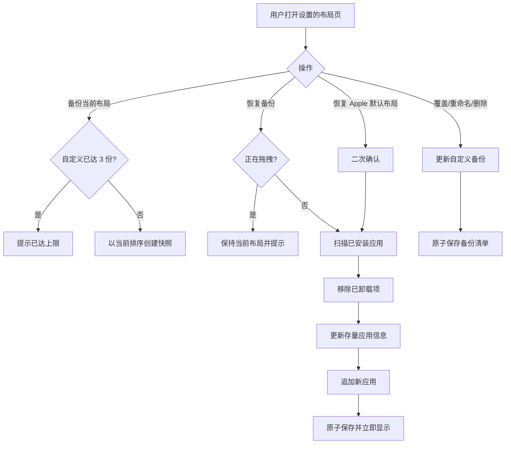

# SPRINT-003：布局备份与切换 — 业务流程

```mermaid
flowchart TD
    A[用户打开设置的布局页] --> B{操作}
    B -- 备份当前布局 --> C{自定义已达 3 份?}
    C -- 是 --> D[提示已达上限]
    C -- 否 --> E[以当前排序创建快照]
    B -- 恢复备份 --> F{正在拖拽?}
    F -- 是 --> G[保持当前布局并提示]
    F -- 否 --> H[扫描已安装应用]
    H --> I[移除已卸载项]
    I --> J[更新存量应用信息]
    J --> K[追加新应用]
    K --> L[原子保存并立即显示]
    B -- 恢复 Apple 默认布局 --> O[二次确认]
    O --> H
    B -- 覆盖/重命名/删除 --> M[更新自定义备份]
    M --> N[原子保存备份清单]
```

该流程只有一个本地用户和一个客户端进程，不涉及网络或外部服务时序。
